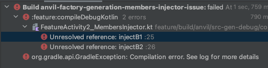

It seems that generating MembersInjector's breaks down at the border between gradle projects.

```
GradleProject1
--------------
class Feature2 : Feature1 <-- Well-formed MembersInjector
abstract class Feature1 : Base2 <-- broken

GradleProject2
--------------  
abstract class Base2 : Base1 <-- Well-formed MembersInjector
abstract class Base1 <-- Well-formed MembersInjector
```


